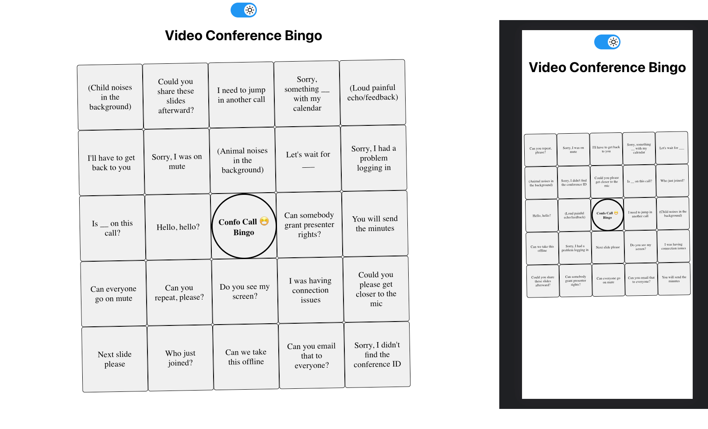
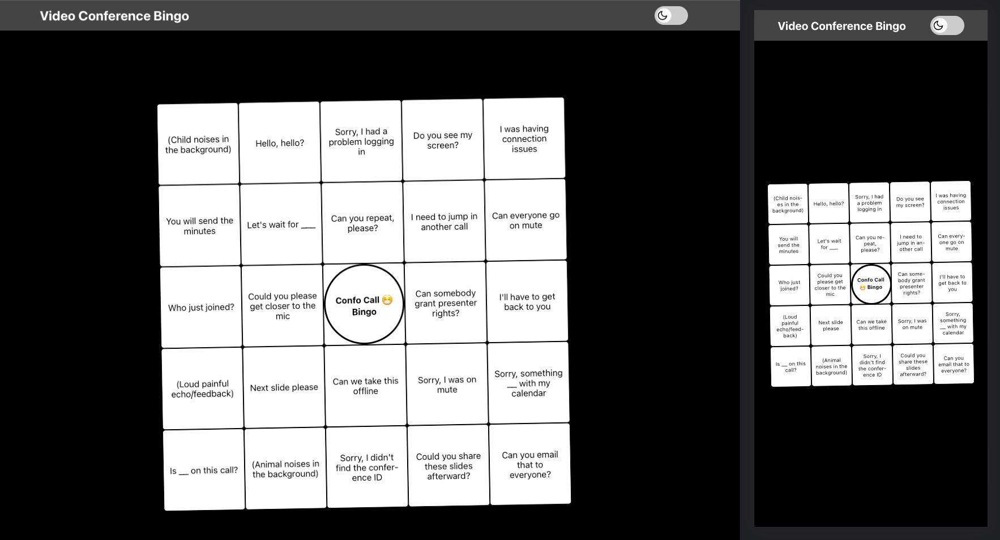

# Video conferencing Bingo App

- [Live-Demo](https://bingo-apps.vercel.app/)

# Light Mode

&nbsp;
&nbsp;

# Dark Mode

&nbsp;

## How to start this project!

## Note This project was created using node version **v17.4.0**

## clone the branch

```
git clone https://github.com/Milan-960/Bingo-App.git
```

## Install dependecies

```
npm install
```

## run on the localhost

```
npm start
```

## BACKGROUND

- **Video conferencing** is an essential part of our daily work. Either working with colleagues internally or meeting with clients and partners.

- But sometimes there's a common wording over and over again. So we created this **simple fun app** to enjoy video conferencing even more. 🤓

- A list of common phrases like: "**Sorry, I couldn't log in**" or "**I had connection issues**" are placed randomly on a standard bingo card.
  If you never played bingo before – what?? 🤯 – [**here**](<https://en.wikipedia.org/wiki/Bingo_(American_version)>) are the basic rules.

## **The most important rules in our version:**

- A player wins by completing a row, column, or diagonal.
- There's a free slot (always on) in the middle
- You can have multiple bingos

### Technologies which have been used 🔥

- [ReactJS](https://react.dev/) SPA
- [React-Sounds](https://www.npmjs.com/package/react-sound) To Provide better user experience!
- [Fireworks](https://www.npmjs.com/package/@fireworks-js/react) To Provide better user experience when they win the game!
- [React-icons](https://react-icons.github.io/react-icons/) Used for a ICONS insted using PNG
- [GSAP](https://greensock.com/gsap/) Used for cool animation!

## Here are the links to the branches!

[Master](https://github.com/Milan-960/Bingo-App)

[Develop](https://github.com/Milan-960/Bingo-App/tree/develop)

# PS: This is just a GIF not original!


