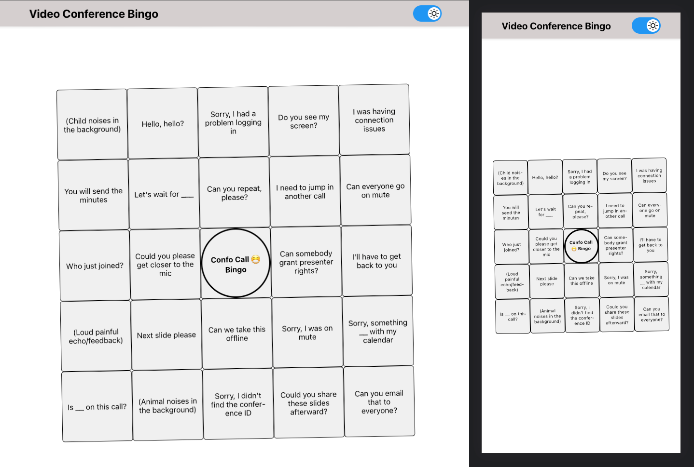

# Video conferencing Bingo App

- [Live-Demo](https://bingo-apps.vercel.app/)

# Folder Structure

```
📦bingo-react-app
 ┣ 📂public
 ┃ ┣ 📜favicon.ico
 ┃ ┣ 📜index.html
 ┃ ┣ 📜logo192.png
 ┃ ┣ 📜logo512.png
 ┃ ┣ 📜manifest.json
 ┃ ┗ 📜robots.txt
 ┣ 📂src
 ┃ ┣ 📂animations
 ┃ ┃ ┣ 📜FireworksDisplay.jsx
 ┃ ┃ ┗ 📜WinAnimation.jsx
 ┃ ┣ 📂components
 ┃ ┃ ┣ 📜BingoCard.jsx
 ┃ ┃ ┣ 📜BingoCell.jsx
 ┃ ┃ ┗ 📜Navbar.jsx
 ┃ ┣ 📂hooks
 ┃ ┃ ┣ 📜useCardPhrases.jsx
 ┃ ┃ ┗ 📜useWinSounds.jsx
 ┃ ┣ 📂sounds
 ┃ ┃ ┣ 📜click.mp3
 ┃ ┃ ┣ 📜explosion0.mp3
 ┃ ┃ ┣ 📜explosion1.mp3
 ┃ ┃ ┣ 📜explosion2.mp3
 ┃ ┃ ┗ 📜explosion3.mp3
 ┃ ┣ 📂styles
 ┃ ┃ ┣ 📂animations
 ┃ ┃ ┃ ┣ 📜_fire-works.scss
 ┃ ┃ ┃ ┣ 📜_win-animation.scss
 ┃ ┃ ┃ ┗ 📜index.scss
 ┃ ┃ ┣ 📂components
 ┃ ┃ ┃ ┣ 📜_bingo-card.scss
 ┃ ┃ ┃ ┣ 📜_bingo-cell.scss
 ┃ ┃ ┃ ┣ 📜_navbar.scss
 ┃ ┃ ┃ ┗ 📜index.scss
 ┃ ┃ ┣ 📜.DS_Store
 ┃ ┃ ┣ 📜Globle.scss
 ┃ ┃ ┣ 📜_app.scss
 ┃ ┃ ┣ 📜_main.scss
 ┃ ┃ ┣ 📜_theme.scss
 ┃ ┃ ┗ 📜_variables.scss
 ┃ ┣ 📂theme
 ┃ ┃ ┗ 📜ThemeContext.jsx
 ┃ ┣ 📂utils
 ┃ ┃ ┗ 📜Phrases.js
 ┃ ┣ 📜.DS_Store
 ┃ ┣ 📜App.jsx
 ┃ ┣ 📜App.test.js
 ┃ ┣ 📜index.css
 ┃ ┣ 📜index.js
 ┃ ┣ 📜logo.svg
 ┃ ┣ 📜reportWebVitals.js
 ┃ ┣ 📜service-worker.js
 ┃ ┣ 📜serviceWorkerRegistration.js
 ┃ ┗ 📜setupTests.js
 ┣ 📜.DS_Store
 ┣ 📜.gitignore
 ┣ 📜README.md
 ┗ 📜package.json
```

# Light Mode

 
 

# Dark Mode

 

## How to start this project!

## Note This project was created using node version **v17.4.0**

## clone the branch

```
git clone https://github.com/Milan-960/Bingo-App.git
```

## Install dependecies

```
npm install
```

## run on the localhost

```
npm start
```

## BACKGROUND

- **Video conferencing** is an essential part of our daily work. Either working with colleagues internally or meeting with clients and partners.

- But sometimes there's a common wording over and over again. So we created this **simple fun app** to enjoy video conferencing even more. 🤓

- A list of common phrases like: "**Sorry, I couldn't log in**" or "**I had connection issues**" are placed randomly on a standard bingo card.
  If you never played bingo before – what?? 🤯 – [**here**](<https://en.wikipedia.org/wiki/Bingo_(American_version)>) are the basic rules.

## **The most important rules in our version:**

- A player wins by completing a row, column, or diagonal.
- There's a free slot (always on) in the middle
- You can have multiple bingos

### Technologies which have been used 🔥

- [ReactJS](https://react.dev/) SPA
- [React-Sounds](https://www.npmjs.com/package/react-sound) To Provide better user experience!
- [Fireworks](https://www.npmjs.com/package/@fireworks-js/react) To Provide better user experience when they win the game!
- [React-icons](https://react-icons.github.io/react-icons/) Used for a ICONS insted using PNG
- [GSAP](https://greensock.com/gsap/) Used for cool animation!
- [React-ink](https://www.npmjs.com/package/react-ink) For Ripple effect in the Bingo-Cell

## Here are the links to the branches!

[Master](https://github.com/Milan-960/Bingo-App)

[Develop](https://github.com/Milan-960/Bingo-App/tree/develop)

# PS: This is just a GIF not original!


# Here are some key findings, ideas, and potential problems for the bingo app!

1. User Experience (UX) improvements:

- Adding smooth transitions or animations for a more enjoyable user experience
- Implementing a tutorial or guide for new users to learn how to use the app

2. Responsiveness and mobile device support:

- Testing the app on various screen sizes and devices to ensure proper display and functionality

3. Performance optimizations:

- Implementing lazy loading for components that are not immediately visible on the screen

4. Accessibility:

- Ensuring the app meets accessibility standards, such as color contrast, keyboard navigation, and screen reader support

5.  Customization:

- Allowing users to create custom bingo cards with their own phrases or images

- Providing different themes or color schemes for a personalized experience

6.  Social features:

- Implementing multiplayer functionality to allow users to play bingo together
- Add the ability to share completed bingo cards or game results on social media platforms

7. Potential problems:

- Security and data privacy concerns: Ensure proper measures are in place to protect user data and privacy

8. Scalability:

- As the app grows in popularity, consider optimizing the backend and infrastructure to handle increased user traffic

9. Monetization strategies:

- Implementing in-app purchases for premium features or content
- Integrate non-intrusive advertisements to generate revenue while maintaining a positive user experience
